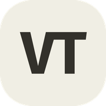
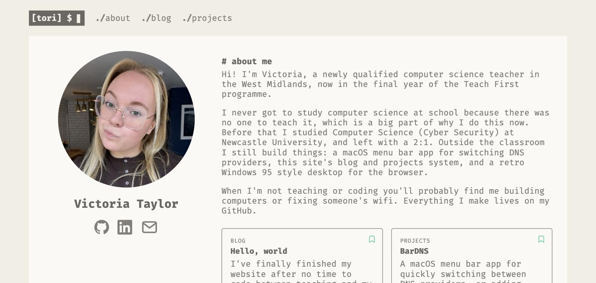

# vtaylor.dev
 

My personal website: an about me page, a blog, and a projects page, built with Node.js + Express and EJS templates, with content stored as markdown under `content/`.

VicOS, the Windows 95-style desktop pastiche that used to live here, has moved to its own repo: [Toadsta/VicOS](https://github.com/Toadsta/VicOS).

## Running this

This is a personal fork of [Birch](https://github.com/Toadsta/birch), a template extracted from this same codebase — see that repo for setup and local development instructions.

## License

This project is licensed under the MIT License - see the [LICENSE](LICENSE.md) file for details.

## Acknowledgments

The contents of the repository was made by me (Victoria Taylor):
1. The theme of the main webpage is inspired by [Risotto](https://github.com/joeroe/risotto) for Hugo
2. Error pages use cat images from [http.cat](https://http.cat)
